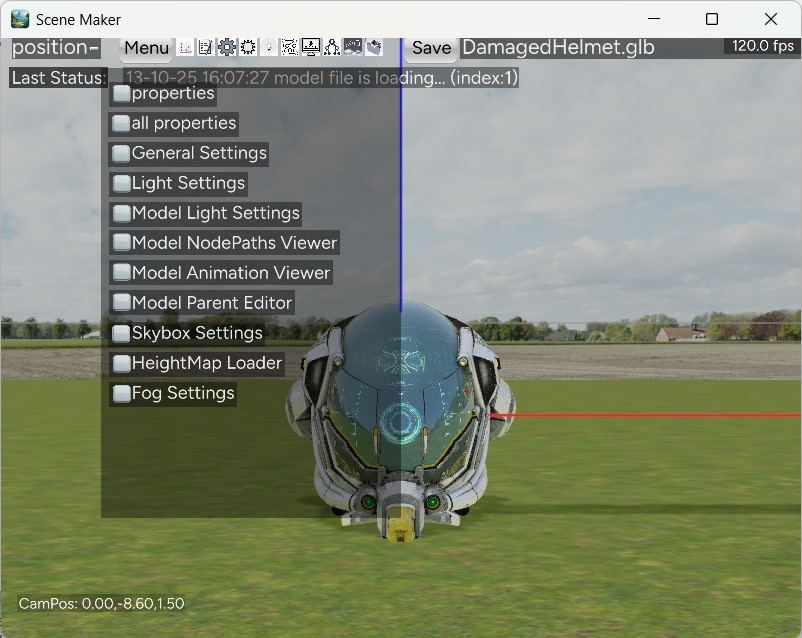

# Scene Maker Panda3D
A Simple Scene Maker for Panda3D.

## Introduction
Create 3D scenes with your 3d models. You can adjust the light properties, view the animations, set the skybox,heightmaps,fog all via simple User Interface.

## Features
* Supports Variety of Model Formats. (egg,bam,glb, etc.)
* Ambient and Directional Light Settings
* Model Point Light Adjuster
* Model Animation Viewer
* Skybox with HDR image support
* Heightmap Loader
* Fog Settings
* Save Scene as JSON file



## Installation and Usage
### For Windows OS:

If already not installed, install Python from https://www.python.org/downloads/ . (python 3.10 or above recommended). <br/>
open command prompt in project folder and install Panda3D by running the command below
```
pip install Panda3D==1.10.14
``` 
Install the required packages using the command below 
```
pip install -r requirements.txt
```
Run the program using the command
```
python scene_maker.py
```
or you can run the program by double-clicking the file 'Run.bat' <br/>

### For Linux OS:
Open the terminal in project folder and run the following <br/>
```
python3 scene_maker.py
```


## Shortcuts

### Mouse Controls
Right click and drag to view the 3D scene

### Keyboard Shortcuts

W - Move Forward <br/>
S - Move Backward <br/>
A - Move Left <br/>
D - Move Right <br/> <br/>

Q - Change property <br/>
Z - Switch models <br/> <br/>

B - Gravity on <br/>
O - Load model <br/>
C - Set camera position to the center of current selected model <br/>
V - Camera look at current selected model <br/>
M - Hide all GUI <br/> <br/>

R - X increase <br/>
F - X decrease <br/>
T - Y increase <br/>
G - Y decrease <br/>
Y - Z increase <br/>
H - Z decrease <br/> <br/>

Delete - Delete the current model <br/>

### Notes
1. Model files should be loaded from the current relative path. When loading from the outside current folder, there is an error occurs.
2. when clicking on "Remove Animation" in GUI, animation names are not immediately removed, but they will not appear after the next restart.

### Disclaimer
1. The functionalities used in this program may not represent the full or true capabilities of Panda3D engine. Some functions may partially used. Some may twisted for specific use cases. For true details, refer Panda3D documentation.
2. All assets used in this program are freely obtained from various sources. See the References section.

### References
1. https://docs.panda3d.org/1.10/python/more-resources/samples/roaming-ralph#roaming-ralph

2. https://www.poliigon.com/texture/flat-grass-texture/4585

3. https://ambientcg.com/view?id=DaySkyHDRI059A

4. https://github.com/KhronosGroup/glTF-Sample-Assets/blob/main/Models/Models-showcase.md

5. https://github.com/panda3d/panda3d/tree/master/samples/shader-terrain

